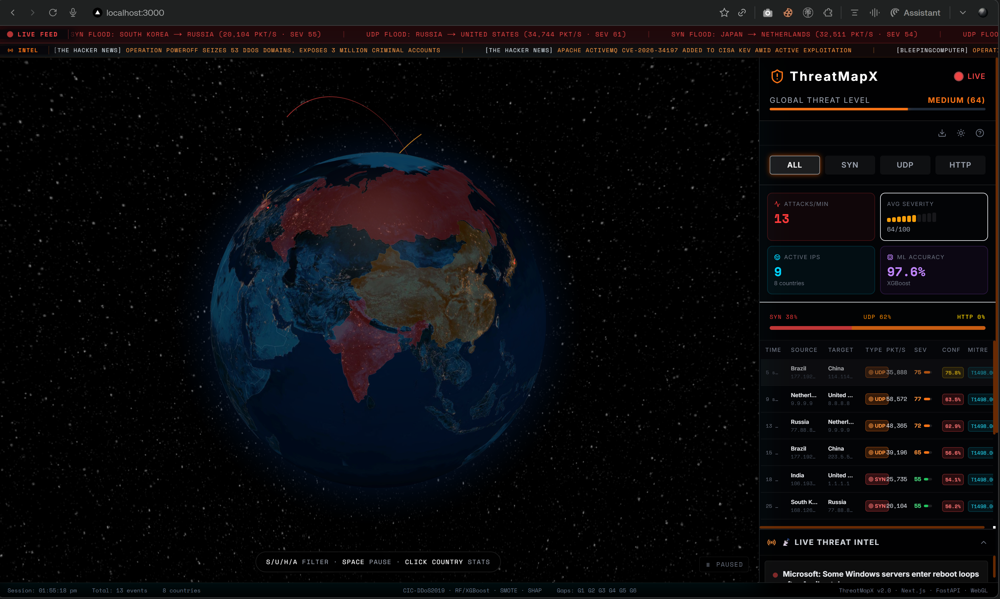

<div align="center">

# 🛡️ ThreatMapX v2.0

### Real-Time DDoS Detection & SOC Visualization Platform

[](.)
[](https://www.unb.ca/cic/datasets/ddos-2019.html)
[](.)
[](https://attack.mitre.org/)
[](.)

**A production-grade SOC dashboard that classifies network traffic in real-time using ML, visualizes attack flows on an interactive 3D globe, and provides SHAP-based explainability — addressing 6 critical research gaps identified across 10 published DDoS detection papers.**

<br/>



</div>

---

## 🎯 Problem Statement

Existing DDoS detection research overwhelmingly focuses on **ML accuracy** but neglects the operational context of a real Security Operations Center (SOC). After surveying **10 peer-reviewed papers (2021–2025)**, we identified **6 critical gaps**:

| Gap | Problem in Literature | ThreatMapX Solution |
|:---:|---|---|
| **G1** | No real-time streaming pipeline — batch inference only | WebSocket + FastAPI live stream at ~1.25 events/sec |
| **G2** | No interactive visualization | 3D WebGL globe with animated attack arcs |
| **G3** | No geographic/spatial context | IP→geolocation mapping + country heatmap overlay |
| **G4** | No SOC integration | MITRE ATT&CK mapping + auto-generated `iptables` rules |
| **G5** | No continuous ingestion | DataStreamer replay engine with synthetic fallback |
| **G6** | No model interpretability | SHAP TreeExplainer — per-prediction feature importance |

---

## 🏗️ Architecture

```
┌──────────────────────────────────────────────────────────────────────┐
│                     FRONTEND (Next.js 14 + TypeScript)               │
│                                                                      │
│  ┌──────────┐ ┌─────────────┐ ┌──────────┐ ┌──────────────────────┐ │
│  │ 3D Globe │ │ Attack Table│ │ KPI Cards│ │ IP Intel Slide-Out   │ │
│  │ (WebGL)  │ │ (sortable)  │ │ (live)   │ │ (SHAP + iptables)    │ │
│  └────┬─────┘ └──────┬──────┘ └────┬─────┘ └──────────┬───────────┘ │
│       └──────────────┴─────────────┴───────────────────┘             │
│                         WebSocket (ws://localhost:8000)               │
└───────────────────────────────────┬──────────────────────────────────┘
                                    │
┌───────────────────────────────────┴──────────────────────────────────┐
│                      BACKEND (FastAPI + Python)                      │
│                                                                      │
│  ┌──────────────┐   ┌────────────────┐   ┌────────────────────────┐ │
│  │ DataStreamer  │──▶│ ThreatClassi-  │──▶│ ConnectionManager      │ │
│  │ (event gen)  │   │ fier (ML)      │   │ (WS broadcast)         │ │
│  └──────┬───────┘   └──────┬─────────┘   └────────────────────────┘ │
│         │                  │                                         │
│  ┌──────┴───────┐   ┌──────┴─────────┐   ┌────────────────────────┐ │
│  │ data/loader  │   │ model.joblib   │   │ REST API               │ │
│  │ CIC-DDoS2019 │   │ + SHAP values  │   │ /api/metrics, /stats   │ │
│  └──────────────┘   └────────────────┘   └────────────────────────┘ │
└──────────────────────────────────────────────────────────────────────┘
```

---

## 🤖 ML Pipeline

### Dataset
- **Primary:** [CIC-DDoS2019](https://www.unb.ca/cic/datasets/ddos-2019.html) — 12M+ labeled network flows with 60+ CICFlowMeter features
- **Fallback:** Synthetic generator matching CICFlowMeter's feature schema (SYN 40%, UDP 30%, HTTP 20%, BENIGN 10%)

### Training Pipeline
| Stage | Detail |
|---|---|
| **Preprocessing** | Drop >50% NaN → VarianceThreshold → Correlation filter (>0.99) → StandardScaler |
| **Class Imbalance** | SMOTE on training set only (O'Brien et al. 2023) — targeted 25% of majority |
| **Model A** | Random Forest (300 trees, balanced class_weight, all CPU cores) |
| **Model B** | XGBoost (200 estimators, max_depth=8, GPU via CUDA) |
| **Winner Selection** | Weighted F1 on 20% holdout split |
| **Calibration** | Isotonic probability calibration (CalibratedClassifierCV, cv=5) |
| **Explainability** | SHAP TreeExplainer — top 20 features by mean |SHAP value| |

### Model Performance (Real CIC-DDoS2019)

| Metric | Value |
|---|---|
| **Winner** | XGBoost |
| **Accuracy** | **97.6%** |
| **Weighted F1** | 0.976 |
| **SYN F1** | 0.994 |
| **UDP F1** | 0.971 |
| **HTTP F1** | 0.957 |
| **BENIGN F1** | 0.998 |
| **Avg Confidence** | 0.975 (calibrated) |
| **Hardware** | NVIDIA RTX 4060 (GPU) |
| **Features Selected** | 41 (from 60+) |

### Label Mapping

| Raw CIC-DDoS2019 Label | Mapped Class | MITRE ATT&CK |
|---|---|---|
| `Syn` | **SYN** | T1498.001 — Direct Network Flood |
| `UDP`, `UDPLag`, `DrDoS_DNS`, `DrDoS_NTP`, `DrDoS_SNMP`, `DrDoS_SSDP`, `DrDoS_LDAP`, `DrDoS_MSSQL`, `DrDoS_NetBIOS`, `DrDoS_Portmap` | **UDP** | T1498.002 — Reflection Amplification |
| `WebDDoS`, `TFTP`, `LDAP`, `MSSQL`, `NetBIOS`, `Portmap` | **HTTP** | T1499.003 — Application Exhaustion Flood |
| `BENIGN` | **BENIGN** | — |

> **Note:** DrDoS (Distributed Reflection DoS) attacks are UDP-based amplification attacks. Mapping them to HTTP is a common labelling error found in several repositories — we corrected this.

---

## ✨ Features

### 🌍 Interactive 3D Globe
- Night-sky earth texture with animated attack arcs (source → target)
- Color-coded by type: 🔴 SYN · 🟠 UDP · 🟡 HTTP
- Country heatmap (top 5 sources/targets highlighted)
- Propagating ring effects at impact points
- Auto-rotation with smart camera snap to high-severity attacks (>80)

### 📊 Real-Time Dashboard
- **KPI Cards** — Attacks/min, avg severity gauge, active IPs, ML accuracy (animated numbers)
- **Attack Table** — Live-updating, sortable by time/severity/confidence, MITRE badges
- **Type Distribution** — SYN/UDP/HTTP breakdown with animated progress bars
- **Connection Status** — WebSocket health with auto-reconnect (exponential backoff)

### 🔍 IP Intelligence Panel
- Slide-out detail view on attack click
- Full attack profile: source/target IPs, severity bar, confidence score
- **SHAP Explainability** — Top 3 features driving each classification
- **MITRE ATT&CK** mapping with tactic, technique ID, and description
- Auto-generated `iptables -A INPUT -s {IP} -j DROP` rule with copy button

### 🛡️ Threat Intelligence
- Live RSS feed from cybersecurity news sources (CISA, Krebs, BleepingComputer, The Hacker News)
- MITRE ATT&CK session coverage panel
- SHAP Feature Importance chart (global model-level)

### ⌨️ Keyboard Shortcuts
| Key | Action |
|---|---|
| `S` | Filter SYN attacks |
| `U` | Filter UDP attacks |
| `H` | Filter HTTP attacks |
| `A` | Show all |
| `Space` | Pause / resume stream |
| `F` | Fullscreen globe |
| `T` | Toggle theme |
| `?` | Show shortcuts |
| `Esc` | Close panels |

---

## 🚀 Quick Start

### Option A — Docker (recommended)

```bash
docker-compose up --build
# Frontend: http://localhost:3000
# Backend:  http://localhost:8000
```

### Option B — Local Development

**Backend:**
```bash
cd backend
pip install -r requirements.txt

# Train model (first time only — auto-trains on startup if model.joblib missing)
python ml/train.py            # auto-detects GPU
python ml/train.py --gpu      # force GPU (CUDA)
python ml/train.py --cpu      # force CPU

# Start API server
uvicorn api.main:app --reload --port 8000
```

**Frontend:**
```bash
# From project root
npm install
npm run dev          # http://localhost:3000
```

### Using Real CIC-DDoS2019 Data
1. Download CSVs from [UNB CIC-DDoS2019](https://www.unb.ca/cic/datasets/ddos-2019.html)
2. Place CSV/Parquet files in `backend/data/cicddos2019/`
3. Delete `backend/ml/models/model.joblib` to trigger retraining
4. Restart the backend — auto-detects real data vs synthetic

---

## 🛠️ Tech Stack

| Layer | Technology |
|---|---|
| **Frontend** | Next.js 14, React 18, TypeScript |
| **3D Visualization** | react-globe.gl, Three.js (WebGL) |
| **Styling** | Tailwind CSS 3.4, Inter + JetBrains Mono fonts |
| **Charts** | Recharts |
| **Icons** | Lucide React |
| **Backend** | FastAPI (Python 3.11+) |
| **Real-Time** | Native WebSocket (FastAPI) |
| **ML** | scikit-learn (Random Forest), XGBoost |
| **Preprocessing** | SMOTE (imbalanced-learn), StandardScaler, VarianceThreshold |
| **Explainability** | SHAP (TreeExplainer) |
| **Calibration** | CalibratedClassifierCV (isotonic) |
| **Dataset** | CIC-DDoS2019 (UNB) |
| **Containerization** | Docker Compose |
| **GPU** | CUDA via XGBoost / RAPIDS cuML |

---

## 📁 Project Structure

```
ThreatMapX/
├── app/                          # Next.js App Router
│   ├── page.tsx                  # Main dashboard (3-panel layout)
│   ├── wallpaper/page.tsx        # Standalone globe (live wallpaper mode)
│   ├── api/news/route.ts         # RSS proxy for threat intel
│   ├── layout.tsx                # Root layout + fonts
│   └── globals.css               # Design system (CSS custom properties)
├── components/
│   ├── GlobeComponentImpl.tsx    # 3D WebGL globe (arcs, rings, heatmap)
│   ├── GlobeView.tsx             # Dynamic import wrapper (SSR-safe)
│   ├── AttackTable.tsx           # Live attack feed table
│   ├── IPIntelPanel.tsx          # Slide-out intelligence panel
│   ├── KPICards.tsx              # Animated KPI metrics
│   ├── MLPanel.tsx               # ML Detection Engine panel
│   ├── MITREPanel.tsx            # ATT&CK technique coverage
│   ├── FeatureImportancePanel.tsx # SHAP feature bar chart
│   ├── ThreatIntelFeed.tsx       # Live RSS threat intel
│   ├── CountryPanel.tsx          # Country-specific attack stats
│   ├── TopBar.tsx                # Header + threat level bar
│   ├── FiltersBar.tsx            # Protocol filter buttons
│   ├── ConnectionStatus.tsx      # WebSocket health indicator
│   └── KeyboardShortcuts.tsx     # Shortcuts modal
├── hooks/
│   ├── useAttackStream.ts        # WebSocket client + reconnection
│   ├── useModelMetrics.ts        # REST: /api/metrics polling
│   └── useThreatIntel.ts         # RSS feed hook
├── types/
│   └── attack.ts                 # TypeScript interfaces (AttackEvent, StreamStats)
├── backend/
│   ├── api/
│   │   ├── main.py               # FastAPI app + lifespan
│   │   ├── websocket.py          # ConnectionManager (broadcast, heartbeat)
│   │   └── routes/               # REST endpoints (health, stats, attacks, metrics)
│   ├── ml/
│   │   ├── train.py              # GPU-aware training pipeline (RF + XGBoost)
│   │   ├── inference.py          # ThreatClassifier (real-time prediction)
│   │   ├── preprocess.py         # Feature engineering + SMOTE
│   │   └── models/               # Saved artifacts (model, scaler, SHAP, metrics)
│   └── data/
│       ├── loader.py             # CIC-DDoS2019 loader + synthetic generator
│       ├── streamer.py           # Event replay engine (async broadcast)
│       └── geo_mapper.py         # IP → geolocation
└── docker-compose.yml            # Full-stack containerization
```

---

## 📚 References

- Shieh (2021), Apostu (2025), Abu Bakar (2023), Arafat (2025), Patil (2023)
- Sharma (2024), O'Brien (2023), Al-Turjman (2023), Patel (2024), Chen (2023)
- Alashhab et al. (2024) — target accuracy benchmark (≥98.7%)
- Dong & Sarem (2020) — severity scoring formula
- MITRE ATT&CK: [T1498.001](https://attack.mitre.org/techniques/T1498/001/), [T1498.002](https://attack.mitre.org/techniques/T1498/002/), [T1499.003](https://attack.mitre.org/techniques/T1499/003/)
- [CIC-DDoS2019 Dataset](https://www.unb.ca/cic/datasets/ddos-2019.html) — Canadian Institute for Cybersecurity

---

<div align="center">

**Built with** Next.js · FastAPI · XGBoost · SHAP · WebGL · WebSocket

</div>
